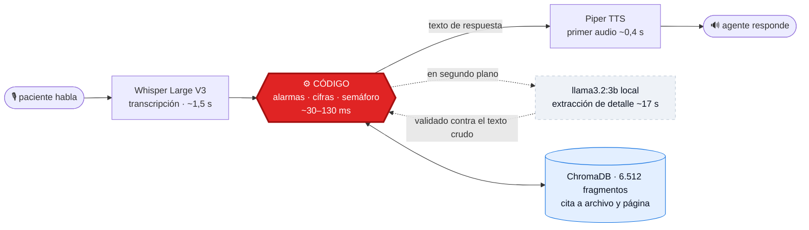

<div align="center">

# 🛡️ Centinela

### Seguimiento posoperatorio por voz — *vigila la recuperación, avisa cuando algo cambia*

**Tech Sphere Challenge 2026**

[]()
[]()
[]()
[]()
[]()

Un agente de voz que llama a pacientes colombianos en posoperatorio, entiende
*"me duele harto la herida y anoche tuve escalofríos"*, responde con la guía
clínica en la mano —cita, documento y página— y decide **en código, no en el
modelo,** cuándo alertar al equipo de salud.

</div>

---

## Por qué este agente es distinto

La mayoría de los agentes clínicos le piden al modelo de lenguaje que sea
inteligente en el momento justo. **Centinela asume que no lo será.** Cada señal
de la que depende una vida vive en código determinista, auditable y probado
contra los 160 casos del reto — y el modelo, un 3B local que cuesta cero, queda
para lo que sí hace bien: entender cómo habla la gente.

El resultado se midió, no se prometió:

| | |
|---|---|
| 🔴 **Recall en casos rojo** | **12/12 — cero falsos negativos** sobre el dataset oficial |
| ⚡ **Latencia percibida P50** | **4,2 s** en llamadas reales (el modelo tarda 17 s — está fuera del camino crítico) |
| 📄 **Trazabilidad** | cada afirmación clínica cita archivo y página, verificables |
| 🎙️ **Sin botones** | escucha automática: el paciente habla, pausa, y el agente responde |
| 💰 **Costo por llamada** | ~US$ 0,0006 — el razonamiento corre local |

---

## Levantamiento (compuerta G2)

Requisitos: Docker con Compose. Nada más.

```bash
git clone <URL_DEL_REPOSITORIO>
cd postop-voice-agent
cp env.example .env        # completar GROQ_API_KEY (ver abajo; la entrega
                           # del reto incluye una key funcional en el .env)
docker compose up
```

Cuando la consola imprima `Application startup complete`, abrir
**http://localhost:8080**. El punto verde de la cabecera confirma que índice,
voz, modelo y transcripción están en pie — es el mismo chequeo de
`GET /api/salud`, que puede consultarse directo.

**Tiempos medidos** (laptop Intel i3-1005G1, 2 núcleos, 20 GB RAM, sin GPU):

| Etapa | Primera vez | Siguientes |
|---|---|---|
| `docker compose build` | ~12 min (descarga torch CPU, voz Piper, embeddings) | segundos (caché) |
| Descarga de `llama3.2:3b` | ~4 min a 100 Mbps (queda en volumen) | 0 |
| Arranque del servicio | ~40 s (carga y calienta modelos) | ~40 s |

La imagen sale del build con **todo adentro** —voz, embeddings, índice
vectorial— para que ninguna descarga corra contra el reloj del levantamiento.

<details>
<summary>Alternativa sin Docker (desarrollo)</summary>

```bash
pip install -r requirements.txt --extra-index-url https://download.pytorch.org/whl/cpu
python -m piper.download_voices es_MX-claude-high --data-dir models/piper
# Ollama nativo: https://ollama.com/download  y luego:
ollama pull llama3.2:3b
cp env.example .env        # completar GROQ_API_KEY
python -m uvicorn src.api.app:app --port 8080
```
</details>

### Credenciales

| Variable | Para qué | Dónde se obtiene |
|---|---|---|
| `GROQ_API_KEY` | Transcripción de voz (Whisper Large V3) | gratis en [console.groq.com](https://console.groq.com/) |

Es la **única** credencial. Si falta o expira, la consola lo dice con nombre y
apellido y bloquea el inicio de llamada — no hay fallos silenciosos.

---

## Modelo de razonamiento (compuerta G3)

**`llama3.2:3b`, local vía Ollama** — de la lista permitida por las bases.

Por qué este y no otro, verificado contra las API reales el 7 de agosto de 2026:

| Modelo permitido | Estado al verificar |
|---|---|
| Google Gemini 1.5 Flash | **retirado por Google** — la cuenta solo sirve 2.0+ |
| Llama 3.1 70B vía Groq | **retirado por Groq** — sirve 3.3-70B, que no está en la lista |
| **Llama 3.2 (1B / 3B) local** | disponible — **elegido: 3B** |
| Phi-3.5 Mini local | disponible |

De los cuatro modelos de la lista, los dos de nube ya no existen como servicio.
El 1B se descartó **por calidad medida**: ante "escalofríos" respondió
"escarmiento" — inventó palabras en contexto clínico. El 3B respondió coherente
y escaló correctamente.

Verificación reproducible: `python scripts/check_groq.py` y
`python scripts/check_gemini.py`.

---

## Arquitectura: el modelo no decide nada clínico

Principio rector: **el comportamiento clínico no puede depender de que el modelo
sea inteligente.** Medido en esta máquina, el 3B tarda ~17 s por extracción y
alucina bajo presión (extrajo `fiebre_c=38` de un texto sin cifra; inventó
`dolor_toracico` cuando se le nombraba la lista de síntomas). Cada una de esas
fallas medidas movió una responsabilidad del modelo al código:

| Señal | Vive en | Por qué |
|---|---|---|
| Síntomas de alarma (disnea, síncope, dehiscencia…) | código (regex sobre habla cruda) | no puede llegar tarde ni alucinarse |
| Decisión de escalamiento (semáforo) | código (umbrales validados) | recall 12/12 en rojo, auditable |
| Temperatura dicha en voz alta | código (parser, dígitos y palabras) | decide el semáforo en el mismo turno |
| Cifras imposibles (58 °C) | código (rango fisiológico) | error de transcripción, se confirma |
| Secuencia de preguntas | código (campos faltantes) | el agente conduce, no improvisa |
| Extracción de detalle (herida, movilidad) | modelo, **en segundo plano** | validada contra el texto crudo: no puede introducir números que el paciente no dijo |

El modelo corre **fuera del camino crítico**: la extracción ocurre mientras el
paciente escucha la respuesta. Latencia percibida medida: **P50 4,2 s** en
llamadas reales de prueba (ver métricas), contra los ~19 s que costaría esperar
la extracción en línea.



**La caja roja es la tesis del proyecto**: la decisión clínica es código con
umbrales validados, no un prompt. El modelo (caja punteada) trabaja fuera del
camino crítico y **no puede introducir un dato que el paciente no dijo** — su
salida se valida contra el texto crudo antes de tocar el cuadro clínico.

## RAG con trazabilidad (20 pts)

- **105 documentos** ingeribles de los 107 PDF del kit (1 escaneado sin capa de
  texto, excluido y reportado; 1 duplicado real detectado por huella de contenido
  — el hash binario no lo veía).
- **6.512 fragmentos** con cita exacta a archivo y página. El índice viaja
  pre-construido: regenerarlo cuesta ~9 min de CPU que G2 no regala.
- **Compuerta de grounding en capas**, no un umbral: se midió que la similitud
  coseno **no separa** lo respondible (0.853–0.927) de lo clínicamente ausente
  (0.871–0.891). Capas: temas prohibidos (dosis/medicación, nunca se responden) →
  filtro por procedimiento del paciente → lista de procedimientos fuera de corpus →
  verificación léxica por raíz → umbral.
- **Conocimiento vivo (G5)**: subir un PDF lo indexa y el agente lo cita;
  borrarlo lo olvida en la misma consulta. Ciclo completo cubierto por tests.
- Hallazgo documentado en [`docs/corpus-hallazgos.md`](docs/corpus-hallazgos.md):
  la carpeta `breast_cancer` del kit contiene literatura de **cuello uterino**
  (18/19 documentos; 0 mencionan mastectomía). Ante pacientes mastectomizadas,
  Centinela declara el límite en vez de citar literatura del órgano equivocado.

## Seguridad

- **Inyección de prompt por documentos**: el texto que entra por la consola se
  neutraliza (patrones de instrucción, delimitadores) y el material recuperado
  viaja delimitado como datos. 14 ataques de prueba bloqueados, 6 textos
  clínicos legítimos intactos.
- La decisión clínica no es inyectable: vive en código.
- Revisiones por fase en [`docs/security/`](docs/security/).

---

## Métricas obligatorias

Fuente: registros JSONL por turno en `logs/` (uno por llamada, más un resumen
estructurado al colgar). **Todo número de esta sección se recalcula con
`python scripts/metricas_readme.py` sobre esos registros** — si no cuadra con
los logs, ese script lo delata.

### Latencia de respuesta (fin de habla → inicio de audio del agente)

Sobre 25 turnos de voz reales de las sesiones de prueba (hardware de referencia:
i3-1005G1, 2 núcleos):

| P50 | P95 |
|---|---|
| **4.196 ms** | **10.620 ms** |

El peor turno registrado (58,7 s) ocurrió cuando la extracción en segundo plano
acaparaba los 4 hilos lógicos; se corrigió limitando el modelo a 2 hilos
(`num_thread=2`) y el turno equivalente posterior midió 6,8 s. Los registros
conservan el caso: los números malos también son evidencia.

### Consumo por turno y por llamada

| Métrica | Valor medido |
|---|---|
| Tokens por turno con extracción (promedio) | ~786 entrada / ~39 salida |
| Invocaciones al modelo por turno | 1 (en segundo plano; 0 en el camino crítico) |
| Consultas RAG por turno | 1 (sustento de protocolo o respuesta a pregunta) |

Nota de atribución: la extracción corre en segundo plano, así que sus tokens se
registran en el turno **siguiente**. El total por llamada cuadra exacto; el
reparto por turno llega con un turno de rezago, y así está documentado en el
código del registro.

### Costo por llamada (extrapolado a API productiva)

El razonamiento corre local (costo marginal 0). Extrapolación declarada:
tarifa pública de Llama 3.1 8B serverless como sustituto comparable
(USD 0,05/M entrada · 0,08/M salida) + Whisper en Groq (USD 0,111/h de audio).

**Llamada típica de 5 turnos: ~USD 0,0006** — dominado por la transcripción.
El cálculo exacto viaja en cada resumen de llamada (`logs/*-resumen.json`).

### Banco de decisión clínica

Motor de escalamiento contra los **160 casos etiquetados** del dataset oficial:

| Métrica | Resultado |
|---|---|
| **Recall en ROJO (12 casos)** | **12/12 — cero falsos negativos** |
| Amarillos degradados a verde | 0 |
| Verdes sobre-escalados | dentro del margen aceptado (≤50) |

Calibrado a propósito hacia el recall: un falso positivo cuesta una llamada de
verificación; un falso negativo en posoperatorio es riesgo clínico. La rúbrica
declara esa asimetría y el motor la implementa.

---

## Los datos del reto

El corpus clínico y el dataset **no se redistribuyen** en este repositorio: los
PDF conservan los derechos de sus autores. Para reconstruir el índice desde el
kit oficial (opcional — ya viaja construido):

```bash
git clone https://github.com/TechSphere2026/ParticipantArtifacts.git ../techsphere-2026
python scripts/ingest.py
python -m pytest tests/  # incluye el banco de 160 casos si el kit está en disco
```

## Estructura

```
src/clinico/    motor de escalamiento, alarmas, fiebre — TODO determinista
src/conversacion/ máquina de turnos, detección de preguntas y terceros
src/rag/        extracción PDF, chunking citable, índice, grounding, saneamiento
src/voz/        Whisper (Groq) y Piper con cadencia natural
src/api/        FastAPI: llamada (G4), conocimiento (G5), salud
web/            consola clínica (tema claro, WCAG AA)
tests/          221 pruebas, incluidas las de conducta conversacional
docs/           hallazgos del corpus, revisiones de seguridad
logs/           registros por turno y resúmenes de llamada (evidencia)
```

## Licencia

MIT — ver [LICENSE](LICENSE).
