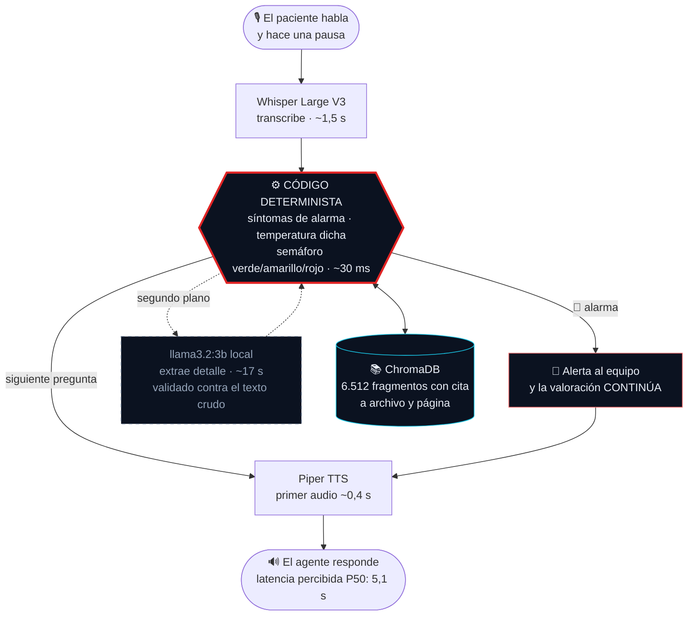

<div align="center">

# 🛡️ Centinela

### Agente de voz para seguimiento posoperatorio

*Vigila la recuperación — avisa cuando algo cambia.*

<br />


**Tech Sphere Challenge 2026** · Source Meridian × AI Thinkers Medellín

</div>

---

## ✨ Qué es

Un agente que **llama por voz** a pacientes colombianos recién operados, entiende
*"me duele harto la herida y anoche tuve escalofríos"*, responde con la guía
clínica en la mano —cita con archivo y página— y decide cuándo alertar al equipo
de salud.

La tesis del proyecto cabe en una frase: **el comportamiento clínico no puede
depender de que el modelo de lenguaje sea inteligente.** Todo lo que decide
sobre la salud del paciente es código determinista, auditable y probado contra
los 160 casos del reto. El modelo —un 3B local que cuesta cero— queda para lo
que sí hace bien: entender cómo habla la gente.

> Conversación de voz sin botones · semáforo clínico en código · RAG citable ·
> conocimiento vivo en caliente · todo el razonamiento corre en la laptop.

---

## 🎯 Cómo funciona una llamada



**La caja roja es el corazón**: la decisión clínica vive en código con umbrales
validados, no en un prompt. El modelo (caja punteada) trabaja **fuera del camino
crítico** —mientras el paciente escucha la respuesta— y no puede introducir un
dato que el paciente no dijo: su salida se valida contra el texto crudo.

---

## 🧩 Lo que sabe hacer

| | |
|---|---|
| 🎙️ **Escucha automática** | El paciente habla, hace una pausa, y el turno viaja solo. Sin botones — como una llamada de verdad |
| 🚦 **Semáforo en código** | Fiebre ≥38, secreción purulenta, dolor ≥8 o síntoma de alarma escalan **solos** — recall 12/12 en los casos rojo del dataset |
| 🗣️ **Entiende cómo habla la gente** | *"treinta y ocho y medio"*, *"30 y 5"*, *"me duele harto"*, *"fiebre no he tenido"* — dígitos, palabras, negaciones y regionalismos |
| 🤔 **No finge haber entendido** | Si la respuesta no aporta el dato, lo dice y repregunta. Si la cifra es imposible (58 °C), pide confirmación. Dos intentos y sigue con gracia |
| 📄 **Responde con la guía en la mano** | Preguntas del paciente → cita textual del corpus con archivo y página, o un honesto *"no lo sé, se lo anoto al equipo"* |
| 🧠 **Conocimiento vivo (G5)** | Subir un PDF → el agente lo cita en la siguiente consulta. Borrarlo → lo olvida. Documento y guion de demostración listos en [`docs/demo/`](docs/demo/) |
| 🚨 **Escala sin colgar** | Ante una bandera roja avisa, **termina la valoración** para que el equipo reciba el cuadro completo, y recapitula al despedirse |
| 👵 **Acoge al cuidador** | *"Soy la hija, yo lo cuido"* → su relato vale y las alarmas barren su texto igual |
| 📋 **Resumen estructurado al colgar** | Semáforo, motivos, cuadro clínico, qué quedó sin preguntar, costo — visible en pantalla y persistido en JSON |

---

## 🖥️ Las dos superficies

**Consola de llamada** — transcripción en vivo, semáforo gigante que se lee de
lejos, hallazgos detectados, panel *"de dónde saca la respuesta"* con la cita o
la capa de la compuerta que bloqueó, y métricas de latencia/tokens/RAG al pie.

**Consola de conocimiento** — subir, listar y eliminar documentos con estado de
procesamiento visible. Índice de 105 documentos listo al arrancar.

Tema claro por defecto (es una consola clínica: salas iluminadas, pantallas
compartidas), oscuro a un clic. Los seis pares de color pasan WCAG AA — medido.

---

## 🚀 Levantamiento (compuerta G2)

Requisitos: **Docker con Compose. Nada más.**

```bash
git clone https://github.com/SalazarDukeImpactHub/centinela.git
cd centinela
cp env.example .env        # completar GROQ_API_KEY (la entrega incluye una funcional)
docker compose up
```

Cuando aparezca `Application startup complete` → **http://localhost:8080**.
El punto verde de la cabecera es el `GET /api/salud`: verde significa que
índice, voz, modelo y transcripción están **de verdad** en pie.

**Medido de punta a punta** en el hardware de referencia (i3-1005G1, 2 núcleos,
sin GPU) con la imagen ya construida:

<div align="center">

| `docker compose up` → sistema operativo |
|:---:|
| **6 min 07 s** |
| *incluida la descarga del modelo de 2 GB* |

</div>

| Etapa | Primera vez | Siguientes |
|---|---|---|
| `docker compose build` | 8 min 39 s (torch CPU, voz, embeddings) | segundos (caché) |
| `compose up` → API respondiendo | 4 min 50 s | ~50 s |
| Descarga `llama3.2:3b` | +1 min 17 s (persiste en volumen) | 0 |

> **Requisito de memoria:** Docker necesita al menos 6 GB. En Windows, si WSL
> reclama más de lo que el equipo puede sostener, el constructor muere a mitad
> del build con `error reading from server: EOF`. Se limita con un `.wslconfig`:
> `[wsl2]` / `memory=6GB` / `swap=4GB`.

La imagen sale del build con todo adentro —voz de Piper, embeddings, índice
vectorial pre-construido— para que **ninguna descarga corra contra el reloj**
del jurado.

<details>
<summary>🔧 Alternativa sin Docker (desarrollo)</summary>

```bash
pip install -r requirements.txt --extra-index-url https://download.pytorch.org/whl/cpu
python -m piper.download_voices es_MX-claude-high --data-dir models/piper
ollama pull llama3.2:3b        # https://ollama.com/download
cp env.example .env            # completar GROQ_API_KEY
python -m uvicorn src.api.app:app --port 8080
```
</details>

**Única credencial:** `GROQ_API_KEY` (Whisper) — gratis en
[console.groq.com](https://console.groq.com/). Si falta, la consola lo dice con
nombre y apellido y bloquea la llamada. **No hay fallos silenciosos.**

---

## 🧠 El modelo (compuerta G3) — y por qué es el único posible

**`llama3.2:3b` local vía Ollama**, de la lista permitida. Verificado contra las
API reales el 7 de agosto de 2026 (`scripts/check_groq.py` · `check_gemini.py`):

| Modelo permitido | Estado real |
|---|---|
| Google Gemini 1.5 Flash | ❌ **retirado por Google** — la cuenta sirve solo 2.0+ |
| Llama 3.1 70B vía Groq | ❌ **retirado por Groq** — sirve 3.3-70B, fuera de la lista |
| **Llama 3.2 3B local** | ✅ **elegido** |
| Llama 3.2 1B local | ⚠️ descartado por calidad: ante *"escalofríos"* respondió *"escarmiento"* |

Los dos modelos de nube de la lista **ya no existen como servicio**. La
arquitectura local no fue una preferencia: fue el único camino sin riesgo de
descalificación — y terminó siendo la mejor decisión del proyecto.

### Cada falla medida del modelo movió una responsabilidad al código

| Señal | Vive en | La falla que lo decidió |
|---|---|---|
| Síntomas de alarma | código (regex sobre habla cruda) | el 3B inventó `dolor_toracico` al ver la lista en el prompt |
| Temperatura dicha | código (parser: dígitos, palabras, "30 y 5") | *"creo que como 38"* escalaba un turno tarde |
| Números alucinados | validación contra texto crudo | el 3B extrajo `fiebre_c=38` de un texto **sin cifra** |
| Cifras imposibles | código (rango fisiológico 30–43 °C) | Whisper transcribió *"38"* como *"58"* y pasó de largo |
| Decisión de escalar | código (umbrales del banco de 160 casos) | no se negocia con un prompt |

---

## 📚 RAG con trazabilidad

- **105 documentos** ingeribles de los 107 PDF del kit — 1 escaneado sin capa de
  texto (excluido y reportado), 1 duplicado real detectado por huella de
  contenido que el hash binario no veía.
- **6.512 fragmentos citables** a archivo y página exacta.
- **Compuerta de grounding en capas** — porque se midió que el umbral no
  alcanza: la similitud coseno de lo respondible (0.853–0.927) **se superpone**
  con la de lo clínicamente ausente (0.871–0.891). Capas: temas prohibidos
  (dosis/medicación: nunca) → filtro por procedimiento del paciente → lista
  explícita fuera de corpus → verificación léxica por raíz → umbral.
- 🔍 **Hallazgo mayor** ([docs/corpus-hallazgos.md](docs/corpus-hallazgos.md)):
  la carpeta `breast_cancer` del kit contiene literatura de **cáncer de cuello
  uterino** — 18/19 documentos; ninguno menciona mastectomía, con 8 pacientes
  mastectomizadas en el dataset. Centinela **declara el límite** en vez de citar
  literatura del órgano equivocado con formato impecable.

---

## 📊 Métricas obligatorias — recalculables, no prometidas

Todo número de esta sección se regenera desde los registros reales con:

```bash
python scripts/metricas_readme.py
```

**Latencia** (fin de habla del paciente → inicio de audio del agente), medida
**dentro de los contenedores** —que es como lo va a correr el jurado— en el
hardware de referencia (Intel i3-1005G1, 2 núcleos, sin GPU), sobre turnos de
voz reales sin ninguna otra carga compitiendo:

<div align="center">

| Mínimo | **P50** | Máximo |
|:---:|:---:|:---:|
| 2.406 ms | **5.131 ms** | 12.713 ms |

</div>

El máximo corresponde al **primer turno de una llamada con el modelo frío**; a
partir del segundo, los turnos se estabilizan entre 2,4 y 6 s.

Dos números peores quedan en los registros históricos y se conservan a
propósito: **58,7 s** cuando la extracción acaparaba los 4 hilos lógicos
—corregido con `num_thread=2`— y un P95 de 19 s medido mientras Docker
construía la imagen en paralelo. **Los números malos también son evidencia**, y
un registro que solo guarda los buenos no sirve para auditar nada.

**Consumo:** ~786 tokens de entrada / ~39 de salida por turno con extracción ·
1 invocación al modelo por turno (en segundo plano, 0 en el camino crítico) ·
1 consulta RAG por turno. La extracción corre en segundo plano, así que sus
tokens se atribuyen al turno siguiente — el total por llamada cuadra exacto.

**Costo por llamada: ~US$ 0,0006** — razonamiento local (marginal 0,
extrapolado a tarifa pública de API comparable: 0,05/0,08 USD por M tokens) +
Whisper en Groq (0,111 USD/h de audio). El desglose viaja en cada
`logs/*-resumen.json`.

**Banco de decisión clínica** contra los 160 casos etiquetados del dataset:

| Métrica | Resultado |
|---|---|
| 🔴 Recall en ROJO — motor aislado | **12/12** |
| 🔴 Recall en ROJO — pipeline conversacional completo | **12/12** |
| 🟡 Amarillos degradados a verde | **0** |
| 🟢 Sobre-escalamiento de verdes | dentro del margen aceptado |

Calibrado a propósito: un falso positivo cuesta una llamada de verificación; un
falso negativo en posoperatorio es riesgo clínico.

---

## 📐 Diagrama e informe

- [`docs/arquitectura.md`](docs/arquitectura.md) — arquitectura, flujo de
  decisión y la compuerta capa por capa. **Cada caja nombra un archivo real**:
  13 de 13 verificados contra el código.
- [`docs/demo/`](docs/demo/) — documento de prueba para la compuerta G5 y el
  guion de los cinco pasos: declarar el límite · subir · citar · eliminar ·
  volver a declararlo.
- [`docs/informe-final.md`](docs/informe-final.md) — declaración de modelo,
  la decisión técnica más relevante con sus siete fallas medidas, alternativas
  descartadas, riesgos y gobernanza.

---

## 🛡️ Seguridad

- ✅ **Inyección de prompt por documentos** neutralizada: la consola de G5 es un
  canal de entrada al prompt, y el texto se sanea + el material recuperado viaja
  delimitado como datos. 14 ataques bloqueados, 6 textos clínicos intactos
- ✅ La decisión clínica **no es inyectable**: vive en código
- ✅ El modelo **no puede inventar datos**: su salida se valida contra lo que el
  paciente dijo
- ✅ Credencial única, fuera del control de versiones, con fallo **ruidoso** si falta
- ✅ Revisiones de seguridad por fase en [docs/security/](docs/security/)

---

## 📂 Estructura

```
src/clinico/       motor de escalamiento, alarmas, fiebre — TODO determinista
src/conversacion/  máquina de turnos, preguntas del paciente, cuidadores
src/rag/           extracción PDF, chunking citable, índice, grounding, saneamiento
src/voz/           Whisper (Groq) + Piper con cadencia natural y cifras habladas
src/api/           FastAPI: llamada (G4), conocimiento (G5), salud
web/               consola clínica — tema claro, WCAG AA medido
tests/             221 pruebas, incluida la conducta conversacional
docs/              hallazgos del corpus, revisiones de seguridad por fase
logs/              registros por turno y resúmenes de llamada (la evidencia)
```

Los datos del reto **no se redistribuyen** (los PDF conservan sus derechos).
Para reconstruir el índice desde el kit oficial — opcional, ya viaja construido:

```bash
git clone https://github.com/TechSphere2026/ParticipantArtifacts.git ../techsphere-2026
python scripts/ingest.py && python -m pytest tests/
```

---

<div align="center">

**Salazar Duke Impact Hub** · Hecho con 🧠 e *inteligencia con alma*

*Los escalofríos son importantes, sobre todo después de una cirugía.*

</div>
