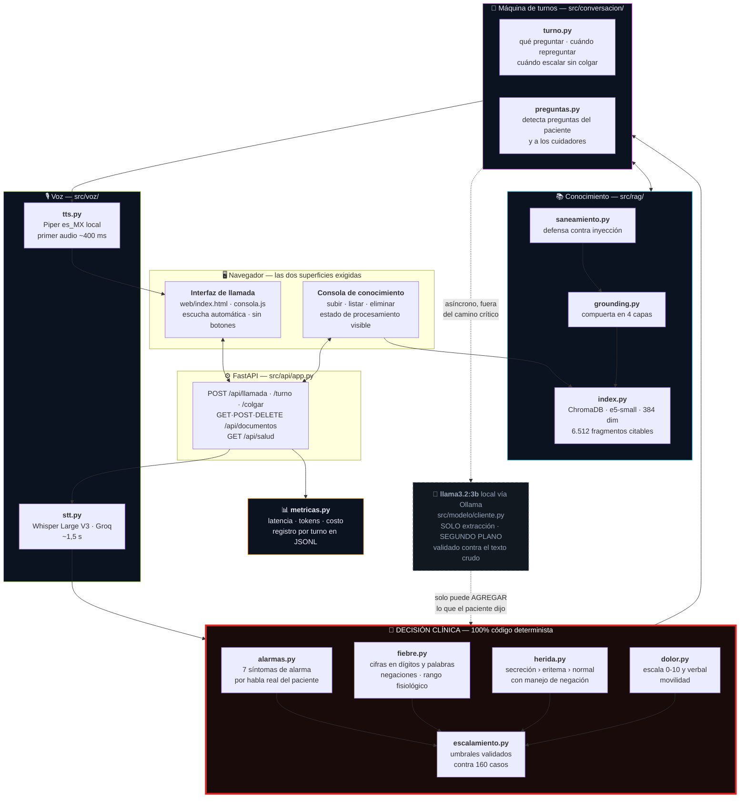
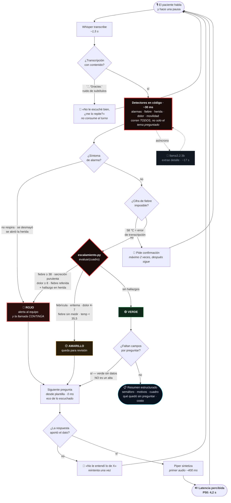
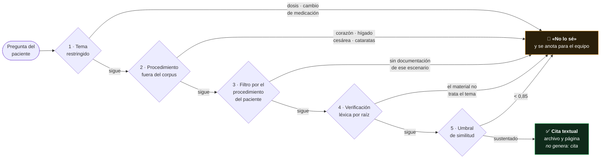

# Arquitectura y flujo de decisión — Centinela

> **Entregable 02.** El jurado toma elementos de este diagrama al azar y los
> busca en el código. Cada caja de aquí nombra un archivo real del repositorio,
> y las cifras son medidas, no estimadas.

---

## 1. Arquitectura de la solución

**La caja roja es la tesis del proyecto.** Todo lo que decide sobre la salud del
paciente vive ahí, en código auditable. El modelo (caja punteada) trabaja fuera
del camino crítico y **no puede introducir un dato que el paciente no dijo**: su
salida se valida contra el texto crudo antes de tocar el cuadro clínico.

---

## 2. Flujo de decisión del agente

---

## 2b. El cuestionario es la agenda, no el guion

Los cuatro temas —fiebre, herida, dolor, movilidad— están fijos y en ese orden
por razones clínicas: fiebre y secreción escalan solas, así que se aseguran
temprano por si la llamada se corta. Una enfermera también entra a la llamada
con esa lista en la cabeza. Lo que la diferencia de un formulario es qué hace
con ella.

Tres reglas, todas en código determinista y **ninguna** delegada al modelo:

| Regla | Qué evita | La falla medida |
|---|---|---|
| **Se tacha lo ya contestado.** Si un detector llenó el dato, el tema queda cubierto aunque nadie lo haya preguntado | preguntar lo que acaban de responder | *"no he tenido fiebre, la herida seca, dolor dos y camino bien"* —los cuatro temas en un turno— y el agente igual preguntaba por la herida; al turno siguiente decía *"no le entendí lo de la herida"* |
| **Se sigue el tema que trae el paciente.** Un tema nombrado pasa al frente de la cola; el pendiente vuelve después con *«volvamos a»* | contestar con la agenda propia | *"me preocupa la herida"* recibía *"disculpe, no le entendí la temperatura"* y la misma pregunta otra vez |
| **Las palabras laxas exigen ancla.** *«bien»*, *«normal»*, *«despacio»* solo valen si el agente acaba de preguntar por ese tema o la frase lo nombra | dar por resuelto lo que nadie dijo | *"no muy bien la verdad, me despierto varias veces"* registraba la **herida como normal** y saltaba la pregunta; en el banco, un caso rojo caía a amarillo |

La tercera regla es la que enseña el orden de las cosas: **la fluidez no se
compra aflojando los detectores**. Al tachar temas automáticamente, cada falso
positivo deja de ser un dato de más y pasa a ser una pregunta que no se hace. La
primera versión de este cambio subió el recall aparente y bajó el real —12/12 a
11/12 en el banco conversacional— hasta anclar las palabras laxas.

Medido sobre los 160 casos de la capa ruidosa: recall en rojo **12/12** y verdes
sobre-escalados **57/123**, contra 61/123 antes del cambio. La conversación se
volvió más corta y más precisa a la vez.

---

## 3. La compuerta de grounding, capa por capa

Se construyó en capas porque **se midió que un umbral solo no alcanza**: la
similitud coseno de lo respondible (0,853–0,927) **se superpone** con la de lo
clínicamente ausente (0,871–0,891).

---

## 4. Cómo se decidió la arquitectura — cada falla movió una responsabilidad

| Señal | Dónde vive | La falla medida que lo decidió |
|---|---|---|
| Síntomas de alarma | código | el 3B inventó `dolor_toracico` al ver la lista en el prompt |
| Temperatura dicha | código | *"creo que como 38"* escalaba un turno tarde |
| Números alucinados | validación vs. texto crudo | el 3B extrajo `fiebre_c=38` de un texto **sin cifra** |
| Cifras imposibles | código | Whisper transcribió *"38"* como *"58"* y pasó de largo |
| Estado de la herida | código | *"roja, hinchada y le sale líquido"* quedaba como eritema |
| Negación de hallazgos | código | *"nada de pus"* se registraba como **secreción purulenta** |
| Dolor y movilidad | código | el eco decía *"un 7 anotado"* y el resumen cerraba *"sin dato"* |
| Decisión de escalar | código | no se negocia con un prompt |
| Minimización sistemática | código | el minimizador reporta verde con cuadro rojo; la señal está en CÓMO habla |
| Orden de las preguntas | código | el agente preguntaba por la herida a quien acababa de describírsela |
| Ancla de las palabras laxas | código | *"no muy bien la verdad"* registraba la **herida como normal** |

**Resultado:** el modelo de lenguaje quedó reducido a lo que hace bien —entender
cómo habla la gente— y ninguna de sus fallas puede llegar al registro clínico.

---

## 5. Verificación

| Qué | Cómo se comprueba | Resultado |
|---|---|---|
| Decisión clínica (motor aislado) | `pytest tests/test_escalamiento.py` | **12/12** en casos rojo |
| Decisión clínica (pipeline completo) | `python scripts/banco_conversacional.py` | **12/12** |
| Conocimiento vivo (G5) | `pytest tests/test_conocimiento_vivo.py` | alta · uso · baja · olvido |
| Defensa contra inyección | `pytest tests/test_saneamiento.py` | 14 ataques bloqueados |
| Dataset contra el kit | `pytest tests/test_dataset.py` | 20 afirmaciones verificadas |
| Levantamiento (G2) | `docker compose up` | **6 min 07 s** de 15 |
| Suite completa | `pytest tests/` | **343 pruebas** |
| Reranker cruzado (descartado) | `python scripts/experimento_reranker.py` | +300 % de latencia, 0/7 aciertos |
